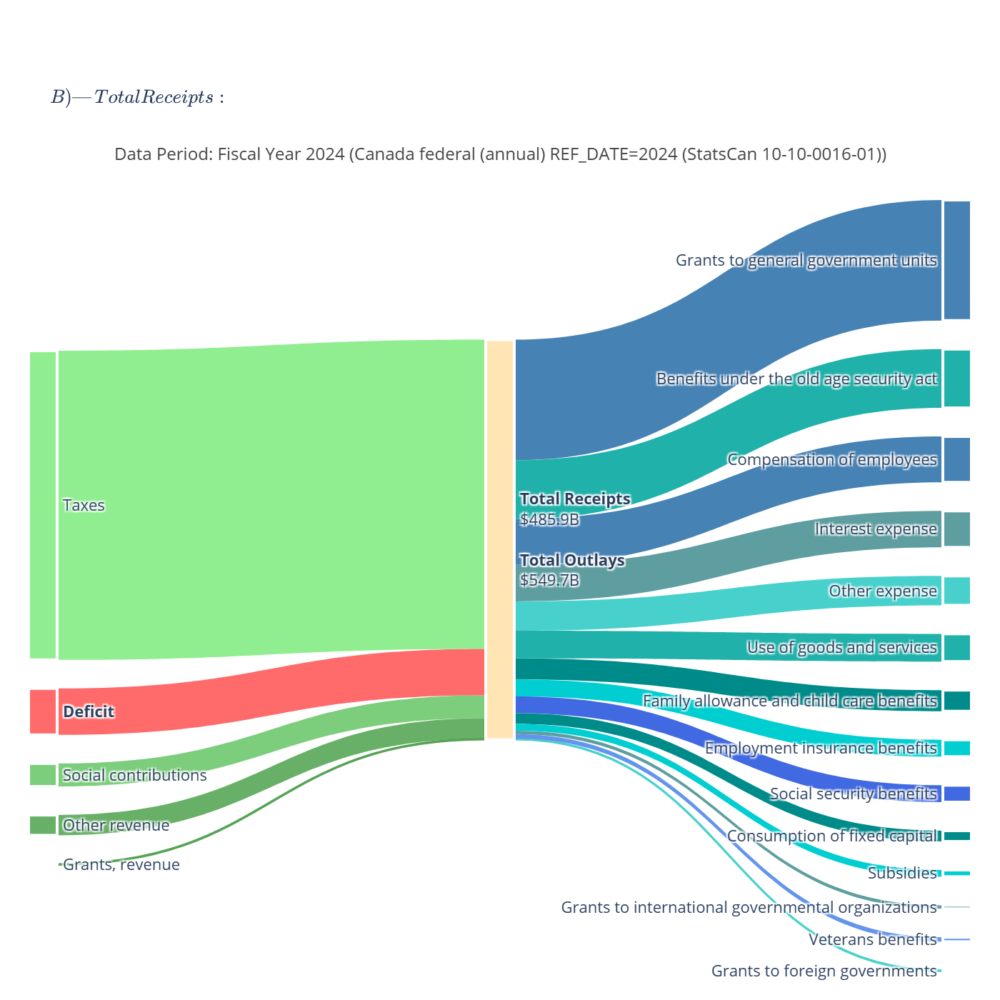
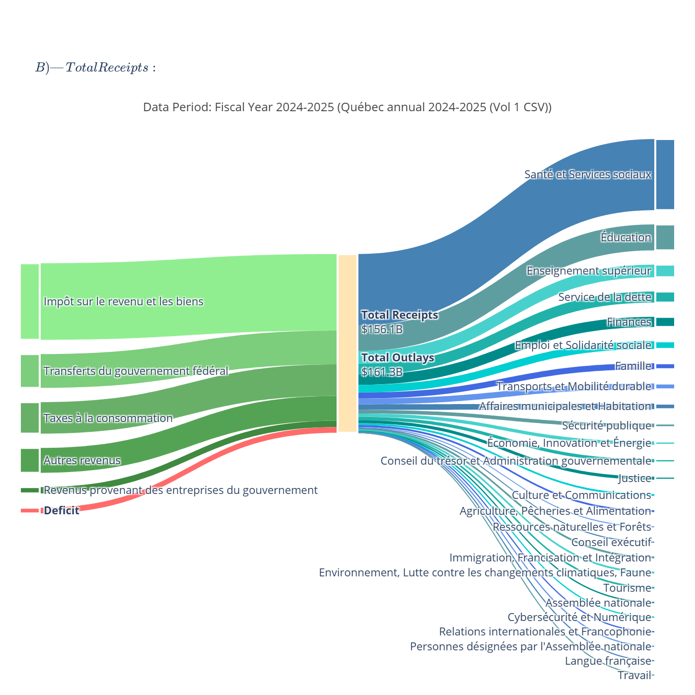

# Canadian & Québec Fiscal Sankey Diagrams

Interactive Sankey diagrams visualizing Canadian federal and Québec provincial government finances with complete fiscal transparency.

## Features

- ✅ **Enhanced Visualizations**: Color-coded flows (green receipts, blue outlays, red deficits), value labels, detailed breakdowns
- ✅ **Complete Transparency**: All spending categories exploded - no hidden "Other" aggregates (e.g., Québec's "Autres portefeuilles" broken into 26 ministries)
- ✅ **Multiple Data Sources**: StatsCan, Finance Canada Fiscal Monitor, Québec Open Data (Volumes 1 & 2)
- ✅ **Period Selection**: Choose specific fiscal years/months or use latest available data
- ✅ **Export Options**: Generate interactive HTML and high-resolution PNG charts, plus structured CSV data

## Installation

### From source

Clone the repository and install in development mode:

```bash
git clone https://github.com/yourusername/canadian-fiscal-sankey.git
cd canadian-fiscal-sankey
pip install -e .
```

## Quick Start

### Generate charts with latest data

```bash
canadian-fiscal-sankey
```

### With CSV export

```bash
canadian-fiscal-sankey --write-csv outputs/data.csv
```

### With specific periods

```bash
canadian-fiscal-sankey --can-annual-ref-date 2023 --qc-annual-year "2023-2024"
```

Charts are saved to `outputs/` folder as interactive HTML and high-resolution PNG files.

## Example Charts

### Canada Federal Finances (2024)



*Revenue: $485.86B | Expenses: $549.68B | Deficit: $63.82B*

### Québec Provincial Finances (2024-2025)



*Revenue: $156.09B | Expenses: $161.26B | Deficit: $5.17B - All 26 ministries shown*

## Visualization Details

Sankey diagrams follow fiscal accounting principles:
- **Receipts** (green) flow INTO the central node
- **Deficit** (red) flows INTO the central node to balance: `Receipts + Deficit = Outlays`
- **Outlays** (blue/teal) flow OUT of the central node
- All amounts labeled in billions (e.g., "$69.1B")
- Fiscal year/period prominently displayed at top
- Central node shows total receipts and total outlays

## Data Sources

Automatically downloads and caches public government data into `source_data/`:

**Canada Federal:**
- [StatsCan Table 10-10-0016-01](https://www150.statcan.gc.ca/n1/en/tbl/csv/10100016-eng.zip) - Annual financial statements
- [Finance Canada Fiscal Monitor](https://www.canada.ca/en/department-finance/services/publications/fiscal-monitor.html) - Year-to-date updates (PDFs)

**Québec Provincial:**
- [Public Accounts Volume 1](https://www.donneesquebec.ca/recherche/dataset/55b05d9f-93d1-450f-a8b9-c761b0c001a8) - Aggregated categories (CSV)
- [Public Accounts Volume 2](https://www.donneesquebec.ca/recherche/dataset/f94cd34c-8202-4cfe-9610-6ae10bf34bc3) - Detailed ministry breakdown (CSV)
- [Financial Situation Reports](https://www.quebec.ca/en/government/departments-agencies/finances/publications) - Year-to-date updates (PDFs)

Generates detailed Sankey diagrams showing:
- **Canada federal (annual)** - Complete breakdown with "Other expense" exploded into subcategories
- **Québec (annual)** - All 26 ministries visible (Health, Education, Debt Service, Agriculture, Economy, Environment, etc.)
- Optional YTD charts with `--include-ytd` flag

---

## Period Selection Options

### Canada Annual (StatsCan)

Select specific fiscal year:
```bash
canadian-fiscal-sankey --can-annual-ref-date 2023
```

### Canada YTD (Fiscal Monitor)

List available months:
```bash
canadian-fiscal-sankey --list-can-fm
```

Select specific month:
```bash
canadian-fiscal-sankey --can-fm-year 2025 --can-fm-month 10
```

### Québec Annual (Public Accounts)

Select fiscal year:
```bash
canadian-fiscal-sankey --qc-annual-year "2024-2025"
```

### Québec YTD (Financial Situation)

Select report year:
```bash
canadian-fiscal-sankey --qc-fin-year 2025
```

### Include YTD Charts

By default, only annual charts are generated. To include YTD:
```bash
canadian-fiscal-sankey --include-ytd
```

---

## Additional Options and updates

### Force refresh
Re-download all source data (ignore cache):
```bash
canadian-fiscal-sankey --refresh
```

### Strict parsing (PDFs)
Fail if any PDF line item is missing (default: relaxed, skips missing items):
```bash
canadian-fiscal-sankey --strict
```

### Debug PDF extraction
Extract PDF text to files for troubleshooting:
```bash
canadian-fiscal-sankey --dump-text
```
Creates `outputs/can_fm_text.txt` and `outputs/qc_fin_text.txt`

---

## Output Files

After running, the `outputs/` folder contains:

**Sankey Diagrams:**
- Interactive HTML files (open in browser for zoom/pan/hover details)
- High-resolution PNG files (scale=2 for presentations/reports)
- Files named with government, period, and data source

**Data Files** (optional with `--write-csv`):
- `raw.csv` - All receipts and outlays in structured format
- CSV includes: government, period, category, amount, unit, source

---

## Example Commands

**Generate latest annual charts:**
```bash
canadian-fiscal-sankey
```

**Generate all charts (annual + YTD) with CSV export:**
```bash
canadian-fiscal-sankey --include-ytd --write-csv outputs/data.csv
```

**Generate specific fiscal years:**
```bash
canadian-fiscal-sankey \
  --can-annual-ref-date 2023 \
  --qc-annual-year "2023-2024" \
  --write-csv outputs/fiscal_2023.csv
```

---

## Key Insights

**Canada Federal (2024):**
- Revenue: $485.86B
- Expenses: $549.68B
- Deficit: $63.82B
- Largest expenses: Grants to provinces ($165.6B), Old age security benefits ($80.8B), Employee compensation ($63.0B), Interest on debt ($50.1B)

**Québec Provincial (2024-2025):**
- Revenue: $156.09B
- Expenses: $161.26B
- Deficit: $5.17B
- Largest expenses: Health & Social Services ($64.2B), Education ($23.4B)
- All 26 ministries visible (no hidden aggregates)

---

## Troubleshooting

**Issue: CSV parsing error**  
Solution: Québec CSVs use semicolons and may have spaces in numbers. This is handled automatically.

**Issue: PDF parsing fails**  
Solution: Use `--dump-text` to inspect extracted text, then `--strict` to identify missing items.

**Issue: No Fiscal Monitor found**  
Solution: Use `--list-can-fm` to see available periods on Finance Canada website.

**Issue: Charts look wrong**  
Solution: Verify totals in the CSV export with `--write-csv` to check data accuracy.

---

## Development & Package Structure

This project uses modern Python packaging with `pyproject.toml` for configuration.

### Project Layout

```
canadian-fiscal-sankey/
├── src/
│   └── canadian_fiscal_sankey/
│       ├── __init__.py          # Package initialization
│       └── main.py              # Core module with main() function
├── pyproject.toml               # Modern Python packaging configuration
├── README.md
├── LICENSE
└── requirements.txt             # Legacy (optional, for reference)
```

---

## Contributing

Contributions welcome! This project aims to provide transparent, accessible visualization of public fiscal data.

**Ideas for contributions:**
- Add more Canadian provinces (Ontario, BC, Alberta, etc.)
- Support additional fiscal periods
- Improve chart layouts and styling
- Add comparative analysis features
- Enhance data validation

Please open an issue to discuss major changes before submitting a PR.

---

## License

MIT License - See LICENSE file for details.

## Data Sources & Attribution

All data sourced from official government publications:
- [Statistics Canada](https://www.statcan.gc.ca/) - [Open Government License - Canada](https://open.canada.ca/en/open-government-licence-canada)
- [Finance Canada](https://www.canada.ca/en/department-finance.html) - Crown Copyright
- [Données Québec](https://www.donneesquebec.ca/) - [Open Data License](https://www.donneesquebec.ca/licence/)

This tool is independent and not affiliated with any government entity.

## Data Sources & Accuracy

All data sourced from official government sources:
- Statistics Canada (StatsCan Table 10-10-0016-01)
- Données Québec (Public Accounts)

Users should verify data accuracy and fiscal calculations 
for their specific use case against official government publications.
